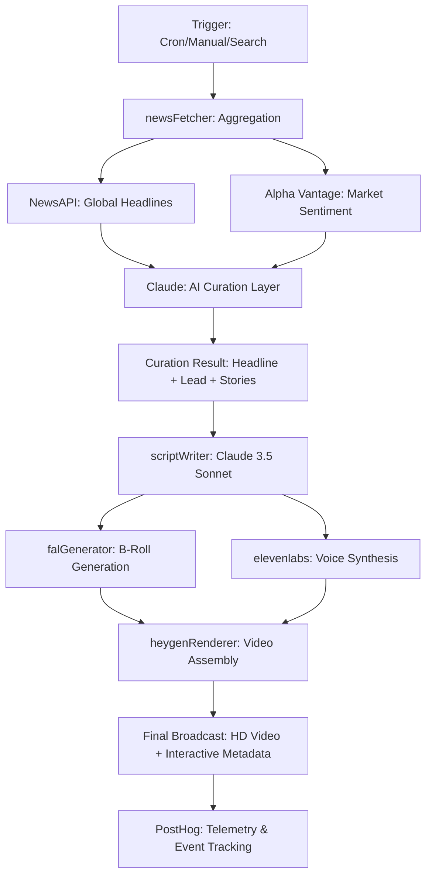

# Axis News

Axis News is a premium, AI-driven news portal featuring **ARIA**, an automated, fully interactive AI anchor. It leverages a sophisticated orchestration pipeline to fetch live news, generate broadcast scripts, synthesize expressive voiceovers, render high-definition B-roll footage, and stream a real-time conversational WebRTC avatar.

## 🌟 Key Features

*   **Tailored Top Stories**: A sophisticated curation layer using **Claude 3.5 Sonnet** that analyzes raw feeds from multiple sources to designate a single, high-impact "Top Story" and supporting headlines for every category.
*   **Multi-Source Intelligence**: Real-time news aggregation merging **NewsAPI** (global events) with **Alpha Vantage** (market sentiment, earnings, and financial topics) for a professional-grade news feed.
*   **Automated Broadcasts**: Scheduled `node-cron` jobs run Morning (7:00 AM) and Night (9:00 PM) editions, automatically crawling primary sources to build a complete newscast.
*   **On-Demand Search**: Users can search for any topic, triggering a real-time, parallelized pipeline that generates a bespoke video broadcast in seconds.
*   **LiveAria WebRTC Avatar**: An interactive, low-latency streaming avatar that viewers can ask questions about the current story, powered by HeyGen's Streaming SDK.

## 🏗 AxisNews Pipeline Architecture

The AxisNews pipeline is designed for high-concurrency, multi-stage AI orchestration. Here is how a single broadcast edition is generated:



### Pipeline Stages:
1.  **Aggregation**: Parallel fetching from NewsAPI (General/Sports/Ent) and Alpha Vantage (Business/Tech/Stocks/Crypto).
2.  **Curation (The "Tailor" Step)**: Claude analyzes up to 20 raw articles per section, selects the most "recent and relevant" top story, and writes a designated anchor lead.
3.  **Scripting**: A dedicated LLM pass generates the full anchor script with precise timing cues.
4.  **Asset Generation**: 
    *   **Visuals**: fal.ai generates dynamic B-roll footage based on the script's theme.
    *   **Audio**: ElevenLabs Turbo v2.5 creates ultra-low-latency voiceovers.
5.  **Assembly**: HeyGen's rendering engine stitches the avatar, audio, and B-roll into a seamless HD broadcast.

## 🛠 Tech Stack

*   **Framework**: Next.js 15 (App Router), React 19
*   **Language**: TypeScript
*   **Styling**: Tailwind CSS, Framer Motion, Lucide React
*   **AI SDKs**: `@anthropic-ai/sdk`, `elevenlabs`, `@fal-ai/client`, `@heygen/streaming-avatar`
*   **Backend Orchestration**: `node-cron`, `axios`, `cheerio`
*   **Analytics**: `posthog-js`, `posthog-node`

## 🚀 Getting Started

### 1. Prerequisites

Ensure you have Node.js 18+ installed.

### 2. Install Dependencies

```bash
npm install
```

### 3. Environment Variables

Create a `.env.local` file at the root of the project and fill in your API keys:

```env
HEYGEN_API_KEY=your_heygen_key
ELEVENLABS_API_KEY=your_elevenlabs_key
ELEVENLABS_VOICE_ID=21m00Tcm4TlvDq8ikWAM  # The ID for ARIA's cloned voice
HEYGEN_AVATAR_ID=your_custom_avatar_id    # Required for Video API (Dashboard)
NEXT_PUBLIC_HEYGEN_AVATAR_ID=your_id      # Required for Streaming SDK (LiveAria)
FAL_KEY=your_fal_key
POSTHOG_KEY=phc_your_posthog_key
POSTHOG_HOST=https://app.posthog.com
NEWS_API_KEY=your_newsapi_key
ANTHROPIC_API_KEY=your_anthropic_key      # For Claude curation and scripting
ALPHA_VANTAGE_KEY=your_alphavantage_key   # For financial news & sentiment
NEXT_PUBLIC_POSTHOG_KEY=phc_your_posthog_key
NEXT_PUBLIC_POSTHOG_HOST=https://app.posthog.com
```

### 4. Run the Development Server

```bash
npm run dev
```

Open [http://localhost:3000](http://localhost:3000) (or whichever port Next.js uses) with your browser to see the application.

## 🤖 Manual Triggers

You can manually trigger the backend orchestration pipeline to generate a full edition via the provided API route:

```bash
curl -X POST http://localhost:3000/api/trigger \
  -H "Content-Type: application/json" \
  -d '{"edition": "morning"}'
```

## 📂 Project Structure

*   `src/app/page.tsx`: Main UI Dashboard with real-time news state
*   `src/app/api/news/route.ts`: Dynamic news curation endpoint
*   `src/components/LiveAria.tsx`: WebRTC Interactive Avatar Interface
*   `src/lib/pipeline.ts`: Master orchestration pipeline for news generation
*   `src/lib/newsFetcher.ts`: Data aggregator & AI Curation Logic
*   `src/lib/scriptWriter.ts`: Claude integration for script generation
*   `src/lib/falGenerator.ts`: fal.ai integration for B-Roll and thumbnails
*   `src/lib/elevenlabs.ts`: ElevenLabs TTS generation
*   `src/lib/heygenRenderer.ts`: HeyGen asynchronous video rendering
*   `src/lib/scheduler.ts`: Node-cron setup for automated daily editions
